## Scope 3 introdcution

Scope 3 emissoions are all indirect emissions which are the result of the activities from assets not owned or controlled by the reporting organization.
Scope 3 emissions are basically all other indirect emissions that occur in a company’s value chain. For majority of the companies, Scope 3 emissionss have the most significant contribution in their overall GHG emissions.

## Scope 3 Categories and Calculation Methods supported in Envizi

The GHG Protocol defines 15 categories of scope 3 emissions which include emissions for  both upstream and downstream of the organization’s activities.

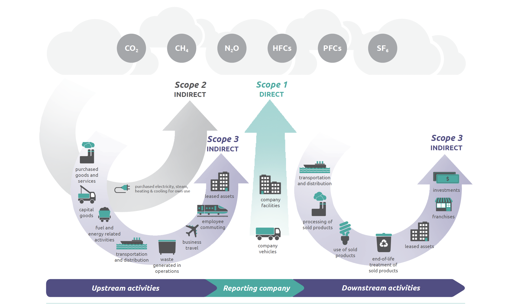

There are 4 different calculation methods available for calculating Scope 3 emissios and depedends the availability of data for the reporting company. 

### Supplier-specific method
   -  Collects product-level cradle-to-gate GHG inventory data from goods or services suppliers.

### Hybrid method
   - Uses a combination of supplier-specific activity data (where available) and secondary data to fill the gaps. 

### Average-data method 
   – Estimates emissions for goods and services by collecting data on the mass (e.g., kilograms or pounds), or other relevant units of goods or services purchased and multiplying by the relevant secondary (e.g., industry average) emission factors (e.g., average emissions per unit of good or service).

### Spend-based method
   – Estimates emissions for goods and services by collecting data on the economic value of goods and services purchased and multiplying it by relevant secondary (e.g., industry average) emission factors (e.g., average emissions per monetary value of goods).

Following the Supplier-specific method helps company to calculate more accurate emissions, however availability of supplier specific data is a big challenge. Hence companies follow the calculation method based on the availability of the data and mostly start with spend-based calculation method and  slowly move towards the more accurate method (Supplier-specific method)  by engaging with suppliers.  

While using spend-based method, the calculation uses industry average emission factors available for various categories. For examplle, Eora’s MRIO (Multi-region input-output) is a globally recognized spend-based emission factor set, which covers 66 spend-based data types.  So while calculate Scope 3 emissions  it is important to derive / map the correct spend-based datatype, to calculate the emissions correctly. 

However it will be mundane task for organizations, because they need to go through the financial transaction data and corresponding details to understand what Spend-based category the transaction belongs to and chose appropriate.  

Using Natural Language Processing featuer of AI can help in identifying the categories by reading through the descriptions of financial transactions. This feature is introduced recently in IBM Envizi called AI Assist. 

## Envizi AI  Assist 

The AI Assist feature of Envizi uses a natural language processing (NLP) engine to identify the commodity category from spend transaction descriptions that are provided by you in the template, and assigns account styles. 

AI Assist will pre-process the spend-based records and assign a mappting Account style.  The user will review the account styles allocated by AI, and then submit the file for loading directly, or modify the account style allocations manually and re-upload a modified file for loading.

# Using AI Assit to classify Scope 3 Purchased Goods & Services data

In this exercise, using AI assist features we will load spend-based data for the Category 1 Purchased goods for our Bank.

This exercise provide the instructions to capture the data by leveraging AI Assit with two different scenarios. 

   - Scenario 1 : Automatically submit the file processed by AI Assist directly 
   - Scenario 2 : Modify the file processed by AI Assist and submit manually

## Download the AI Assit template

1. `Manage` -> `Data Uploade Templates`

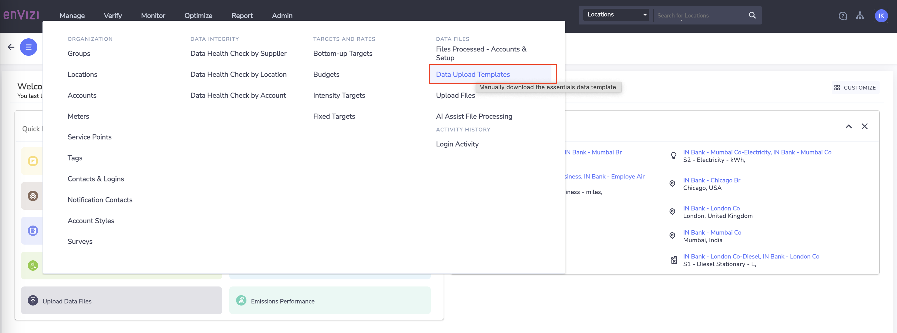

2. Select the file `Account Setup and Data Load - AI Assist` , click on `Actions` and `Download`

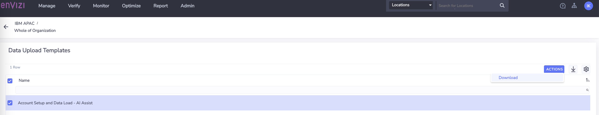

3. View file `Account Setup and Data Load - AI Assist.xlsx` contents

4. Go through all the 4 sheets of the file carefully to get more insights on AI Assist feature

   1. `Records to load` - This is main data file which will be processed once uploaded into the system 
   2. `Guidance` - Provides overview of AI Assist, important notes on how to use various fields, do and don't 
   3. `Supported account styles` - Provides list Account styles supported for Scope 3 - Category 1 Purhased Goods and Services in Envizi through Eora 66 Emission factor library
   4. `Template fields definitions` - Details on field types , mandatory or optinal, etc

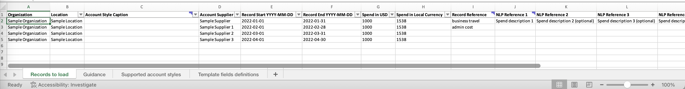

## Scenario 1: Automatically submit the file processed by AI Assist directly 

1. Make a copy of the template file 

2. Prepare the temlate file by filling relavante columns or take the sample file available [here](./files/data/Account%20Setup%20and%20Data%20Load%20-%20AI%20Assist-set1.xlsx)

3. Verify the values of the mandatory fields
   
   - Organization
   - Location
   - Record Start YYYY-MM-DD
   - Record End YYYY-MM-DD
   - Spend in USD
   - NLP Reference 1

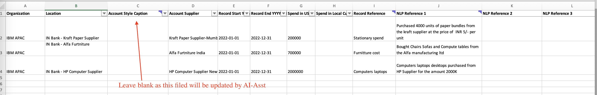

4. Navigate to Envizi UI and click on  `Manage` ->  `AI Assit File Processing`

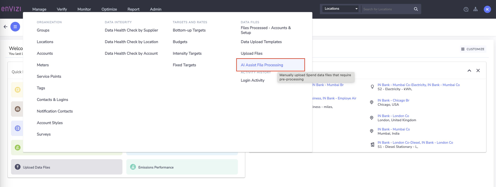

5. Click on `Upload For AI Processing`

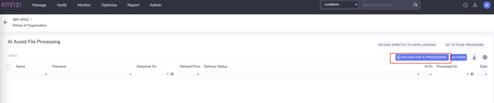

6. Select the file with Scope 3 spend based data and `Save`

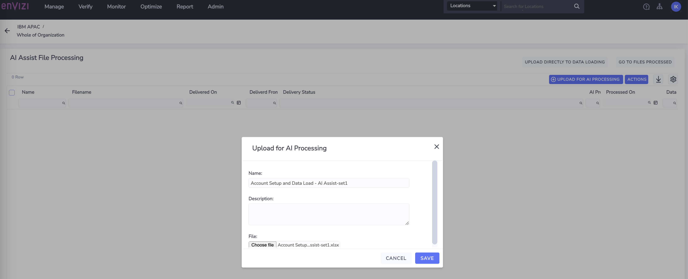

7. Once the file status changed to `Complete`, click on `Actions` -> `Download Processed File`

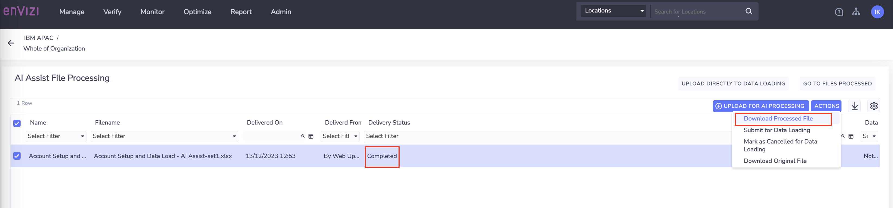

8. Open the file 

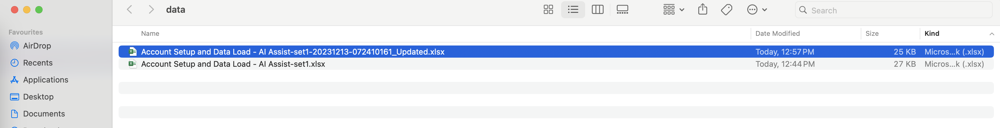

9. Verify the value of the column `Account Style Caption` updated by AI Assit

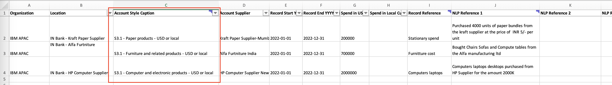    

Observe that the `Account style caption` is mapped correctly for the Cat 1 purchased goods acitvity data type baed on the Natural language description provided in the NLP reference column. 

10. As we are satisfied with the account style mapped by AI Assist, we will proceed to laod the data by uploading this file directly from AI Assist page.

Submit the file for data loading.  `Manage` -> `AI Assist File Processing` -> Select the file -> click on `ACTIONS` -> `Submit for Data Loading`
 

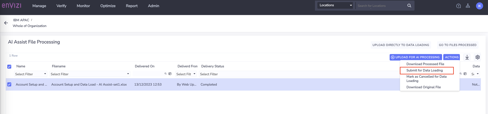      

11. Check the status of the field `Data Loading Status` and wait till it shows `Submitted` and Click on `GO TO FILES PROCESSED`

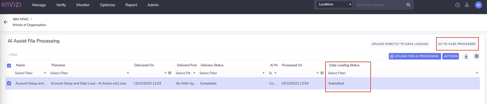      

12.   Verify `File Status`  as `Loaded` and no errors. 

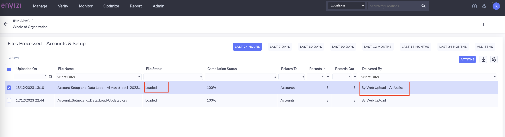    

13.  Verify the Accounts created and data loaded. Navigate to `Organization Hierarchy` -> pick `locationt` and view the `Accounts` 

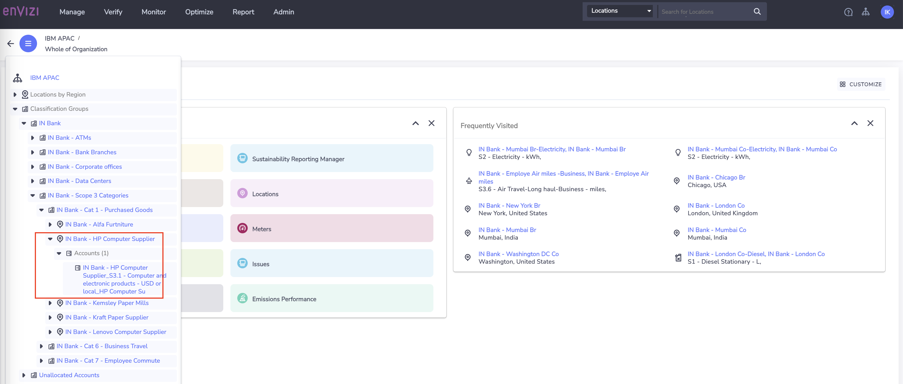  

14.  Click on the `Account` to view Account Summary page and look at `Account style` and `Records` loaded

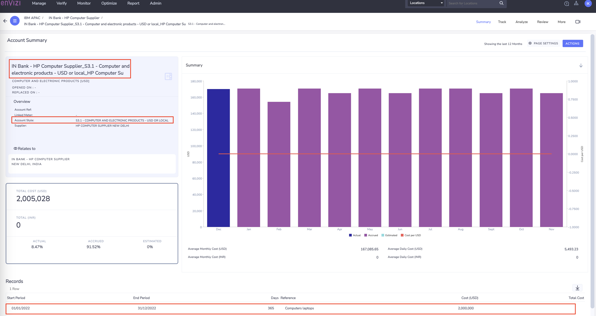      

This concludes the Scenario 1 lab using the AI assist feature for deriving the relevant Account style for the spend based data of Scope 3 Category1. 

## Scenario 2 : Modify the file processed by AI Assist and submit manually

The following exercise calls out a a scenario where the account style assigned by AI assist is not mapped to correct Scope 3 Category data type. In such cases, users can modify the account style according to their requirement and then upload the files manually. Lets follow the steps to replicate this scenario.

1. A sample file provided here - [Account Setup and Data Load - AI Assist-set2.xlsx](./files/data/Account%20Setup%20and%20Data%20Load%20-%20AI%20Assist-set2.xlsx) to replicate the scenario

2. Update the fields as required. The file content looks like

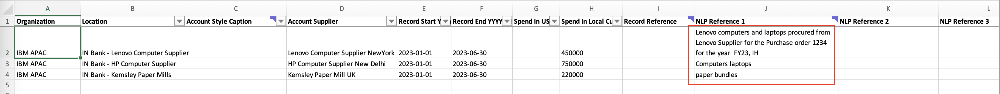 

3. Navigate to Envizi UI and click on  `Manage` ->  `AI Assit File Processing`

4. Click on `Upload For AI Processing` 

5. Select the file updated in step-2 and `Save`

6. Once the file status changed to `Complete`, click on `Actions` -> `Download Processed File`

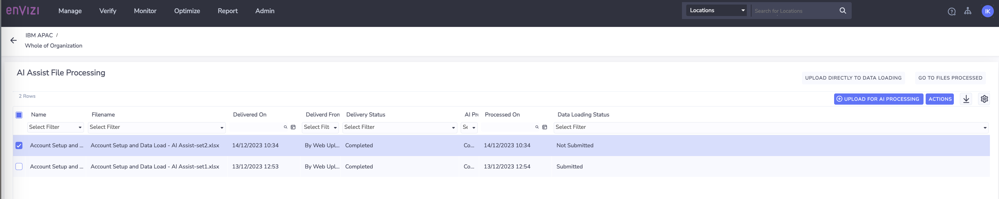

7. Open the `downloaded` file which is processed by AI Assit

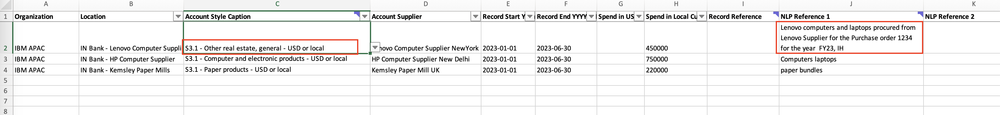

8. Verify the value of the column `Account Style Caption` updated by AI Assit

    

9. Observe that the `Account style caption` column against each spend data.  Apart from Records/ Row 1, for the rest it is mapped correctly

For Row 1, the spend data is related to computers and laptops purchased, however AI Assiste mapped to it as `S3.1 - Other real estate, general - USD or local` , which is incorrect. 

10. Update the `Account style caption` for the Row 1 to `S3.1 - Computer and electronic products - USD or local`
You can click on `Account style caption`  drop-down to chose  the correct one or can refer to sheet `Supported account styles`

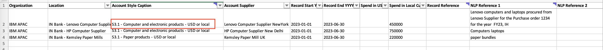

11. As we have modified the file after AI Assit processing, we can't directly submit the file for data loading as we did in the previous exercise. Here, we need to manual provide the file to upload. 

`Manage` -> `AI Assist File Processing` -> Select the file -> click on `UPLOAD DIRECTLY TO DATA LOADING`

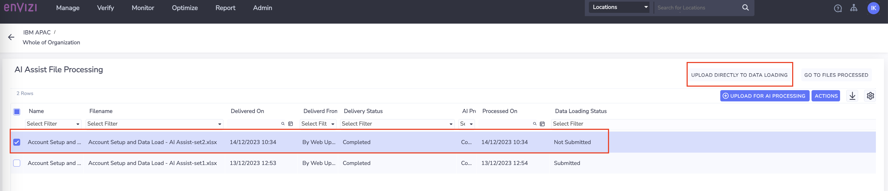

12. Check the status of the file from AI Assist page. Observe the filed status  - `AI Processing Status` - `Not Applicable` . This is because, the file we have uploaded is already having the `Account style caption` filled. AI Assist only process the rows if the `Account style caption` is blank and the `NLP reference 1` column is filled. 

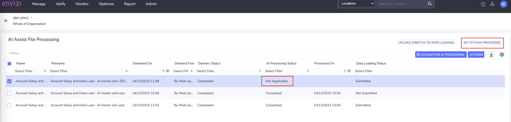

13.  Click on `GO TO FILES PROCESSED` , which shows the file status and the number of accounts created. 

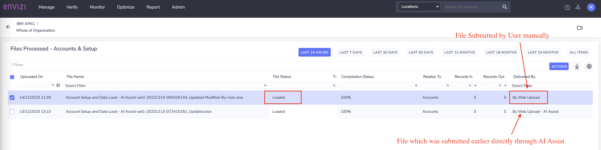

Observe the values of the fields `File Status` , `Records In`, `Records Out` and `Delivered By`

14. For the locations specificed in the data loading file, verify that  the accounts are created and the records are loaded by navigating through the `Organization Hierarchy` or going to the `Manage`-> `Location` -> `Accounts` -> view each account details .

This concludes the exercise. Happy Learning !

## Conclusion

In this lab exercise, we have learnt how Envizi uses Natural Language Processing (NLP) using the AI Assit feature, for categorizing the Spend based data into the appropriate Scope 3 Category 1 Purchased Goods & Services.  We have also looked into steps to follow when AI assist maps the correct account style as well as how to handle when the category mapped is not statisfactorty to the user requirement. 

